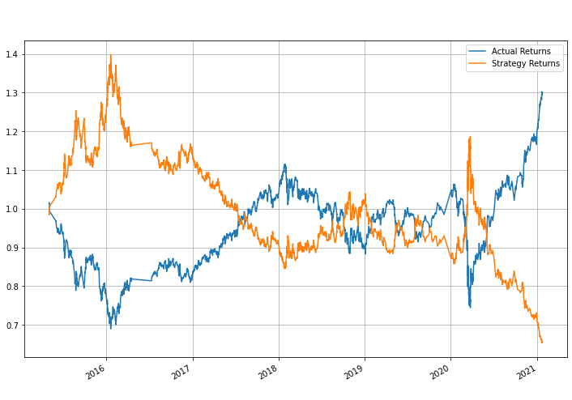
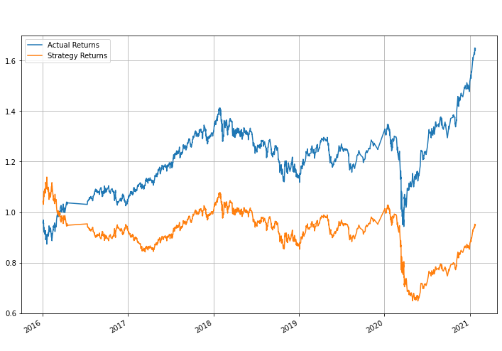

# Welcome to the Trading Signals with Machine Learning (ML) Project!<a id="Top-of-Page">
***
## Cotents<a id="Contents">
[Project Description](#Project-Description) 
[Technologies and Resources](#Technologies-Resources) 
[Installation Guide](#Installation-Guide) 
[Outputs](#Outputs) 
[Summary](#Summary) 
[Contributors](#Contributors) 
[License](#License) 
[Bottom of Page](#Bottom-of-Page) 

***
## Project Description<a id="Project-Description">
This project provides adaptive machine learning models for optimizing autonomous algorithmic trading. In short, this is an algorithmic trading bot.  
The trading model is generated by establishing a baseline model, and then improving upon with the appropriate ML modeling utilities. 
    
#### Project layout:
The layout of this project is show below. 
. 
├── data 
│   ├── applicants_data.csv 
│   ├── applicants_data.h5 
│   ├── applicants_data_A1.h5 
│   ├── applicants_data_A2.h5 
│   └── applicants_data_A3.h5 
├── img 
│   └── neural-network-model-accuracy-report.png 
├── LICENSE 
├── README.md 
├── tree.txt 
└── venture_funding_with_deep_learning.ipynb 

***
## Technologies and Resources<a id="Technologies-Resources">
#### Technologies:
<a href="https://docs.python.org/release/3.8.0/" title="https://docs.python.org/release/3.8.0/">

***
## Installation Guide<a id="Installation-Guide">
### Project Installation
To install <a href="https://github.com/jasonjgarcia24/trading-signals-with-ml.git" title="https://github.com/jasonjgarcia24/trading-signals-with-ml.git">trading-signals-with-ml</a>, type <code>git clone https://github.com/jasonjgarcia24/trading-signals-with-ml.git</code> into bash in your prefered local directory.  
Alternatively, you can navigate to the same address (<code>https://github.com/jasonjgarcia24/trading-signals-with-ml.git</code>) and download the full <code>main</code> branch's contents as a zip file to your prefered local directory. 

## Usage<a id="Usage">
Observe trading-signals-with-ml with <code>machine_learning_trading_bot.ipynb</code>. No input variables are required. 

### Outputs<a id="Outputs">
Multiple variations of Support Vector Classification (SVC) and Adaptive Boost Classification were performed to help identify which strategy would yield the best returns. The following efforts were performed: 
    
| Trial # | Parameters | Results | Description |
| :---:   |:---       | :---:   | :---        |
| **1** | Classifier: SVC Short Window SMA: 4 days Long Window SMA: 100 days Training Window: 3 months |  | Slightly better performance with the strategy versus the actual. |
| **2** | Classifier: AdaBoostClassifier with GaussianNB base estimator Short Window SMA: 4 days Long Window SMA: 100 days Training Window: 3 months|  | Very good returns with the cumulative AdaBoost strategy returns nearly twice of the actual returns. |
| **3** | Classifier: SVC Short Window SMA: 4 days Long Window SMA: 100 days Training Window: 1 month |  | The reduced training window seems to have a very small impact on the SVC strategy returns. |
| **4** | Classifier: AdaBoostClassifier with GaussianNB base estimator Short Window SMA: 4 days Long Window SMA: 100 days Training Window: 1 months|  | The reduced training window seems to have a significant negative impact on the AdaBoost strategy returns. |
| **5** | Classifier: SVC Short Window SMA: 4 days Long Window SMA: 100 days Training Window: 9 month |  | The increased training window seems to have a small negative impact on the SVC strategy returns. |
| **6** | Classifier: AdaBoostClassifier with GaussianNB base estimator Short Window SMA: 4 days Long Window SMA: 100 days Training Window: 9 month |  | The increased training window seems to have a significant negative impact on the AdaBoost strategy returns. |
| **7** | Classifier: SVC Short Window SMA: 30 days Long Window SMA: 100 days Training Window: 3 month |  | The increased short window SMA seems to have a significant impact on the SVC strategy returns. This may be due to overfitting of our data given the classification report below:   |
| **8** | Classifier: AdaBoosterClassifier with GaussianNB base estimator Short Window SMA: 30 days Long Window SMA: 100 days Training Window: 3 month |  | The increased short window SMA seems to have a very good impact on the AdaBoost strategy returns, however this is not the best thus far. | 

***
## Summary<a id="Summary">
Overall, the original SVC model seems to be consistently aligned with marginal improvements to the actual results. The AdaBoostClassifier with GaussianNB base estimator, however, does have a model with significant improvements to the actual returns (trial \#2). 
    
***
## Contributors<a id="Contributors">
Currently just me :) 

***
## License<a id="License">
Each file included in this repository is licensed under the <a href="https://github.com/jasonjgarcia24/vc-applicant-classifier/blob/53dc9a508bf8f1a1b34fc2a086ef9d2e3a293d8b/LICENSE" title="LICENSE">MIT License.</a>

***
[Top of Page](#Top-of-Page) 
[Contents](#Contents) 
[Project Description](#Project-Description) 
[Technologies and Resources](#Technologies-Resources) 
[Installation Guide](#Installation-Guide) 
[Outputs](#Outputs) 
[Summary](#Summary) 
[Contributors](#Contributors) 
[License](#License) 

